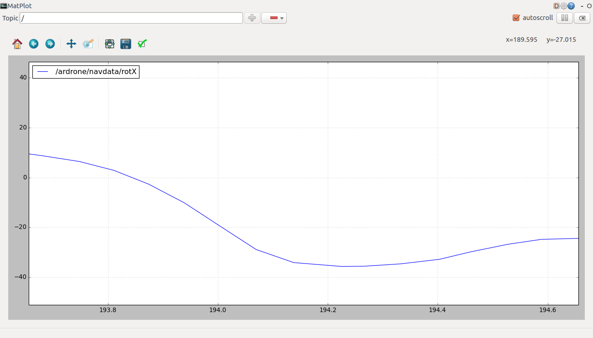
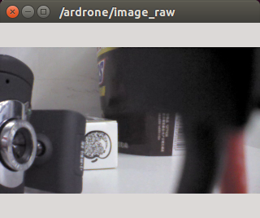
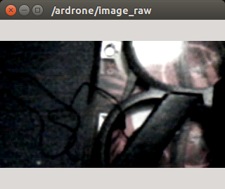
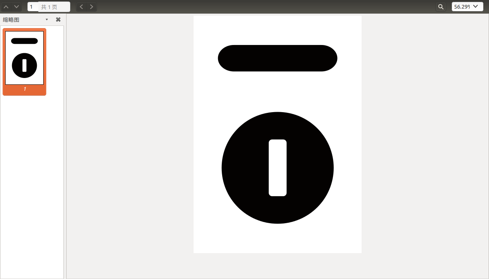

#ROS下ARdrone开发探索(1)

##1.安装和打开驱动节点
```
# sudo apt-get install ros-indigo-ardrone-autonomy
# roscore
NT# rosrun ardrone_autonomy ardrone_driver
```

##2.获取无人机数据
###2.1 设置系统更新速率
**无人机的更新速率**:由*navdata_demo*参数决定,当设置为1时,传输频率为15hz.为0时,速率为200hz.(该参数为布尔值)

**驱动更新速率**:可以设置为实时或者固定速率,由*realtime_navdata*参数决定,当它被设置为True时,驱动为实时速率模式(获得数据立刻就显示);当它被设置为Flase,为固定速率模式(数据先缓存,然后以固定速率发送,这个速率由*looprate*参数设置)
此时启动驱动节点代码为:
```
/默认设置
# rosrun ardrone_autonomy ardrone_driver _realtime_navdata:=False _navdata_demo:=0
/200hz 实时更新速率
# rosrun ardrone_autonomy ardrone_driver _realtime_navdata:=True _navdata_demo:=0
/15hz 实时更新速率
# rosrun ardrone_autonomy ardrone_driver _realtime_navdata:=True _navdata_demo:=1
```
###2.2 获取数据
####导航数据
导航数据发布到了*ardrone/navdata* 主题,这时以15hz实时更新速率为例.
```
# roscore
NT# rosrun ardrone_autonomy ardrone_driver _realtime_navdata:=True _navdata_demo:=1
NT# rostopic echo /ardrone/navdata 
```
获得数据格式为:
```
header: 
  seq: 181
  stamp: 
    secs: 1447641780
    nsecs: 72214206
  frame_id: ardrone_base_link
batteryPercent: 65.0
state: 2
magX: 33
magY: 9
magZ: -37
pressure: 100944
temp: 249
wind_speed: 0.0
wind_angle: 0.0
wind_comp_angle: 0.0
rotX: -1.58899998665
rotY: 0.189999997616
rotZ: -0.462000012398
altd: 0
vx: 0.0
vy: -0.0
vz: -0.0
ax: 0.0153172221035
ay: -0.0402716584504
az: 1.00194382668
motor1: 0
motor2: 0
motor3: 0
motor4: 0
tags_count: 0
tags_type: []
tags_xc: []
tags_yc: []
tags_width: []
tags_height: []
tags_orientation: []
tags_distance: []
tm: 128647368.0
---
```
####IMU数据
使用命令:
```
# rostopic echo /ardrone/imu
```
获得的数据格式为:
```
header: 
  seq: 1395
  stamp: 
    secs: 1447642252
    nsecs: 903238161
  frame_id: ardrone_base_link
orientation: 
  x: -0.018762187083
  y: 0.00515051602951
  z: -0.0764514333328
  w: 0.996883459017
orientation_covariance: [0.0, 0.0, 0.0, 0.0, 0.0, 0.0, 0.0, 0.0, 0.0]
angular_velocity: 
  x: -0.0014556189999
  y: -0.00220580981113
  z: 0.000873185927048
angular_velocity_covariance: [0.0, 0.0, 0.0, 0.0, 0.0, 0.0, 0.0, 0.0, 0.0]
linear_acceleration: 
  x: 0.116103763506
  y: -0.46441545561
  z: 9.69921030998
linear_acceleration_covariance: [0.0, 0.0, 0.0, 0.0, 0.0, 0.0, 0.0, 0.0, 0.0]
```
使用rqt_plot 可视化数据:
```
# rosrun rqt_plot rqt_plot /ardrone/imu/x
```
获得图象,


####磁场数据
使用命令:
```
# rostopic echo /ardrone/mag
```
获得的数据格式为:
```
header: 
  seq: 1815
  stamp: 
    secs: 1447642460
    nsecs: 119943874
  frame_id: ardrone_base_link
vector: 
  x: 0.61329048872
  y: 0.296753466129
  z: -0.731991887093
```

####里程数据
使用命令:
```
# rostopic echo /ardrone/mag
```
获得的数据格式为:
```
header: 
  seq: 337
  stamp: 
    secs: 1447642612
    nsecs: 657935907
  frame_id: odom
child_frame_id: ardrone_base_link
pose: 
  pose: 
    position: 
      x: 0.0
      y: 0.0
      z: 0.0
    orientation: 
      x: -0.0188895665809
      y: 0.00374660533345
      z: -0.290900369116
      w: 0.956559523747
  covariance: [0.0, 0.0, 0.0, 0.0, 0.0, 0.0, 0.0, 0.0, 0.0, 0.0, 0.0, 0.0, 0.0, 0.0, 0.0, 0.0, 0.0, 0.0, 0.0, 0.0, 0.0, 0.0, 0.0, 0.0, 0.0, 0.0, 0.0, 0.0, 0.0, 0.0, 0.0, 0.0, 0.0, 0.0, 0.0, 0.0]
twist: 
  twist: 
    linear: 
      x: 0.0
      y: -0.0
      z: -0.0
    angular: 
      x: 0.0
      y: 0.0
      z: 0.0
  covariance: [0.0, 0.0, 0.0, 0.0, 0.0, 0.0, 0.0, 0.0, 0.0, 0.0, 0.0, 0.0, 0.0, 0.0, 0.0, 0.0, 0.0, 0.0, 0.0, 0.0, 0.0, 0.0, 0.0, 0.0, 0.0, 0.0, 0.0, 0.0, 0.0, 0.0, 0.0, 0.0, 0.0, 0.0, 0.0, 0.0]
```
####单独选择一个数据发布到一个主题上
通过编写launch文件,设置*enable_navdata_time=True* 能够单独开启一个命名为ardrone/navdata_time主题,并发布导航时间到这个主题上.具体能够使用那些数据,参见ardrone-sdk.

####获取摄像头图像

ARdrone 由前向和对地的两个摄像头,驱动节点一共发布三个主题
ardrone/image_raw
ardrone/front/image_raw
ardrone/bottom/image_raw
使用可以使用image_view来查看三个图像
其中采用**rosservice call /ardrone/togglecam**来在两个摄像头间切换
例如:
```
# rosrun image_view image_view image:=ardrone/image_raw
# rosservice call /ardrone/togglecam
# rosrun image_view image_view image:=ardrone/image_raw
```
图像如下
 


#### 板载机器视觉探测数据
在navdate中我们看到有
```
tags_count: 0
tags_type: []
tags_xc: []
tags_yc: []
tags_width: []
tags_height: []
tags_orientation: []
tags_distance: []
```
这些消息参数,这就是板载的视觉处理系统如果探测到标志物的话就会把数据发送到这些消息上来.
具体的标志图案如下

在使用命令:
```
# roslaunch ardrone_autonomy ardrone.launch 
```
注意到这里需要调整一些参数,所以使用了launch文件调整参数后启动.这是把刚才标志图案打印后放到飞行器下方,在navdate中就能观察到了标志物的信息和数据.
```
# rostopic echo /ardrone/navdate
tags_count: 1
tags_type: [131072]
tags_xc: [534]
tags_yc: [658]
tags_width: [259]
tags_height: [345]
tags_orientation: [140.84048461914062]
tags_distance: [53.0]
tm: 438659264.0

```
具体参数的解释,参见[wiki](https://github.com/AutonomyLab/ardrone_autonomy/wiki/AR-Drone-Parameters)

到此,ardrone第一步的安装和获取数据测试结束.
